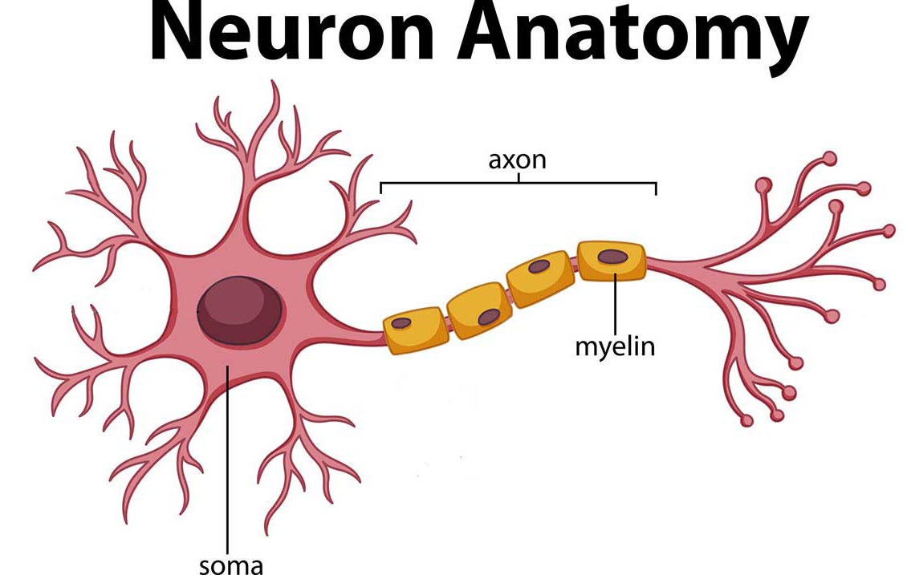

The brain is a complex organ that controls thought, memory, emotion, touch, motor skills, vision, breathing, temperature, hunger and every process that regulates the body. Together, the brain and spinal cord that extends from it make up the central nervous system, or CNS

1. Weight = ~ 3 pounds
2. 60% = fat
3. 40% = combination of water, protein, carbohydrates and salts
4. Not a muscle - contains blood vessels and nerves, including neurons and glial cells

The different composition of neuron parts is why the two below appear as separate shades on certain scans.

1.   Gray Matter - Primarily composed of Soma
2.   White Matter - Axons and Myelin

1.   Soma - The round, central cell bodies
2.   Axon - The long stems that connect neurons together
3.   Myelin - Wraps the Axons, protective coating.
